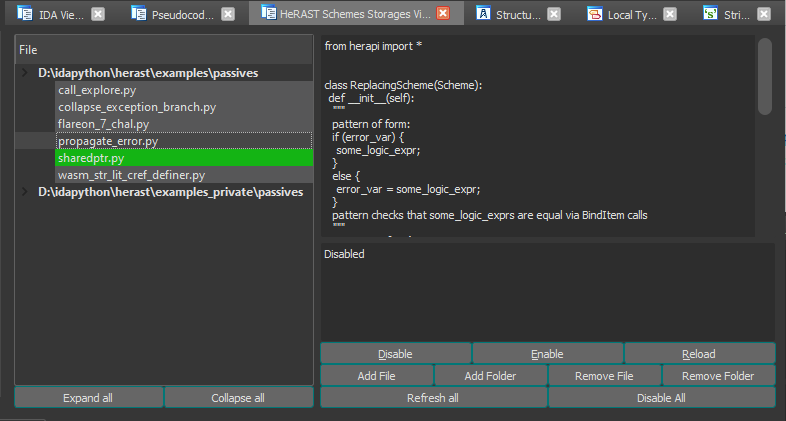

# herast

Rewritten for IDAPython3 (IDA_VERSION >= 7.4) version of [@groke](https://github.com/grokeus)'s [HRAST](https://github.com/sibears/hrast).
Contains more features, more convenient and richer language for AST patterns and its handling, simple GUI for easier management and expanding over time repository with ready AST patterns (PRs are welcome!).

## What it does

Herast helps with finding AST subtrees and with following work with found items. Herast provides its API via [herapi](https://github.com/mostobriv/herast/tree/main/documentation/herapi.md) module and via GUI view via Shift-M hotkey. Herast is designed for easy expandability, simple reusage and for fast scripting.

## Installation

- Place `herast/` to `$IDA_DIR/python/3/` directory
- Place `herapi.py` to `$IDA_DIR/python/3/` directory
- Place `herast.py` to `$IDA_DIR/plugins` directory

## Use already written AST handlers

Add this [folder](https://github.com/mostobriv/herast/tree/main/examples/passives) for IDB in Schemes Storages View (Shift-M) or globally via herapi.add_storage_folder(folder_name, global_settings=True). Then enable needed storages and see the results applied to pseudocode.  

Couple examples:  
collapse_exception_branch replaces  

  
into

  

propagate_error replaces  

  
into  

  

## Create your own AST handlers

- Write [patterns](https://github.com/mostobriv/herast/tree/main/documentation/patterns.md) that describe parts of AST
- Write [schemes](https://github.com/mostobriv/herast/tree/main/documentation/schemes.md) that describe handling of found patterns
- Either export schemes to passive matcher (herapi.register_storage_scheme), that will later automatically apply them on the fly and modify every decompilation output (see [examples](https://github.com/mostobriv/herast/tree/main/examples/passives))
OR  
- Use them as scripts with the help of [Matcher](https://github.com/mostobriv/herast/blob/main/herast/tree/matcher.py) (see [examples](https://github.com/mostobriv/herast/tree/main/examples/scripts))
